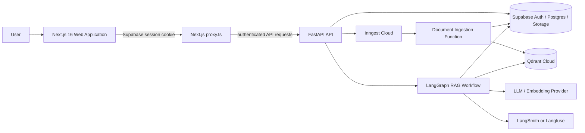
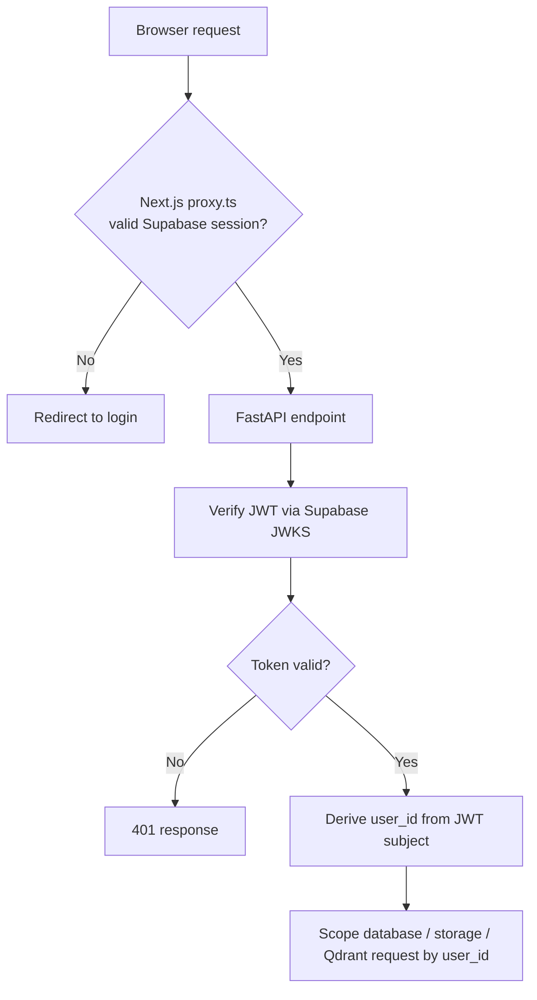
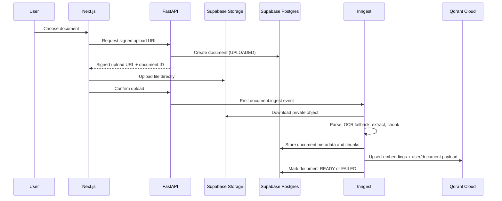
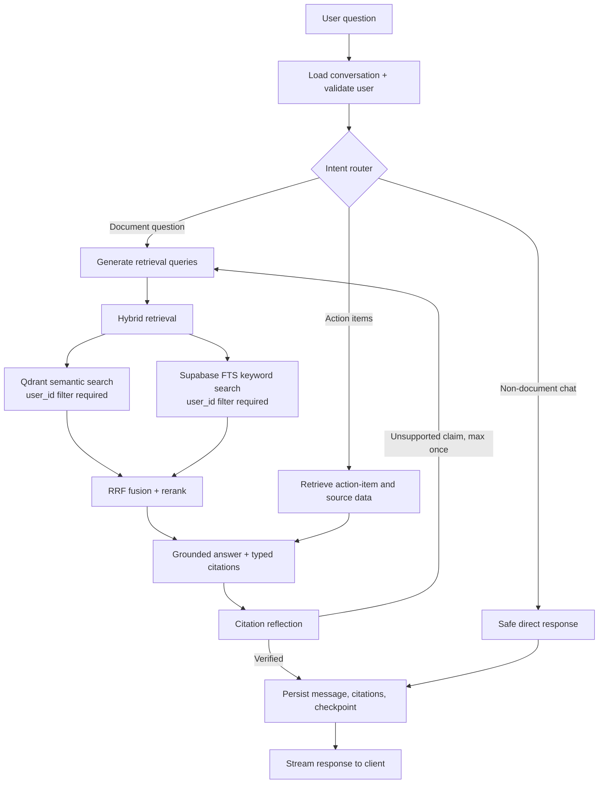

# Sift Architecture

## Status

This document defines the approved target architecture. It is not evidence
that a component is already implemented. Consult `docs/progress.md` for the
current delivery state.

## System Overview



## Component Responsibilities

| Component | Responsibility |
| --- | --- |
| Next.js web application | Authentication UI, document library, upload UX, streaming chat, citation/source viewer, action-item review UI. |
| Next.js `proxy.ts` | Redirects unauthenticated browser users away from protected routes. This is a UX guard, not the sole authorization boundary. |
| FastAPI | Validates Supabase JWTs, owns API contracts, creates signed storage URLs, enforces authorization, starts workflows, and streams graph output. |
| Supabase Auth | Managed email/password identity and session lifecycle. |
| Supabase Postgres | Source of truth for metadata, conversations, citations, action items, ingestion jobs, audit events, and LangGraph checkpoint state. |
| Supabase Storage | Private storage for original uploaded files. Database rows store object keys, not file blobs. |
| Inngest Cloud | Durable, retry-safe document parsing, extraction, chunking, and embedding workflows. |
| Qdrant Cloud | Semantic vector search with mandatory `user_id` payload filtering. |
| LangGraph | Explicit agent state graph for routing, retrieval, grounded generation, reflection, and persistence. |
| LLM provider | Structured extraction, query rewriting, grounded answer generation, and embeddings. Provider/model names remain configuration values. |

## Security Boundary



The backend never accepts a user identity from request JSON, query parameters,
and data filtering enforce security.

## Document Ingestion Workflow



Document lifecycle:

```text
UPLOADED → QUEUED → PARSING → EXTRACTING → EMBEDDING → READY
                                                      └→ FAILED
```

The workflow is idempotent by document version/checksum. Retrying an ingestion
job must not create duplicate chunks or Qdrant points.

## Query and Answer Workflow



All document-derived claims must map to a stored chunk. If retrieval does not
provide enough evidence, the answer explicitly says so.

## Data Model

| Table | Purpose | Key access constraint |
| --- | --- | --- |
| `profiles` | Application metadata for Supabase Auth users | User reads/updates only their row. |
| `documents` | File metadata, state, checksum, storage key | `user_id` ownership. |
| `document_versions` | Re-ingestion/history for a document | Parent document ownership. |
| `document_jobs` | Ingestion attempts and failures | Parent document ownership. |
| `chunks` | Page/section text and retrieval metadata | `user_id` ownership; linked to document. |
| `conversations` | User chat sessions | `user_id` ownership. |
| `messages` | User/assistant messages | Inherits conversation ownership. |
| `message_citations` | Message-to-source evidence mapping | Inherits message ownership. |
| `document_extractions` | Typed dates, parties, amounts, renewal terms | Parent document ownership. |
| `action_items` | Suggested/confirmed user actions | `user_id` ownership and source citation. |
| `audit_events` | Security and product activity trail | Server-written, user-readable only where appropriate. |
| `evaluation_runs` | Offline quality metrics | Internal/admin-only. |

Qdrant points contain the vector and only minimal retrieval payload:
`user_id`, `document_id`, `chunk_id`, `page`, `section`, and document type.
The authoritative full chunk text and citation metadata remain in Supabase.

## Managed Environments

| Environment | Supabase | Qdrant | Inngest | Deployment |
| --- | --- | --- | --- | --- |
| Development | Dedicated `sift-dev` project | Dev collection | Dev app | Local Next/FastAPI or preview deployments |
| Production | Separate `sift-prod` project | Production collection | Production app | Vercel + Render/Railway |

Supabase MCP is allowed only for the development project. Production schema
changes run through reviewed migrations in the deployment workflow.
